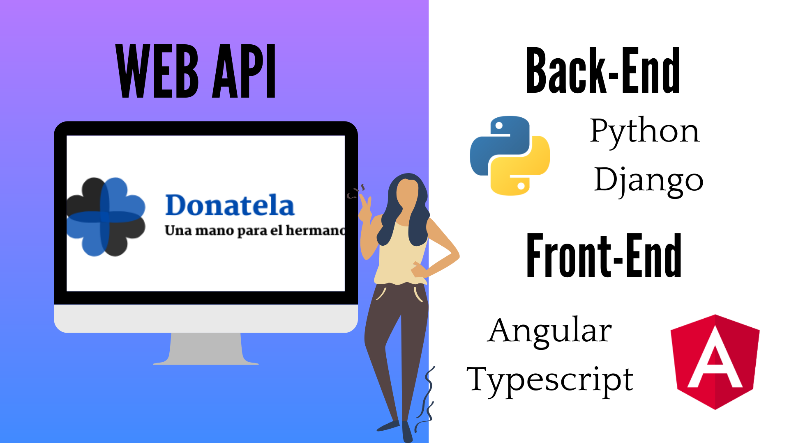
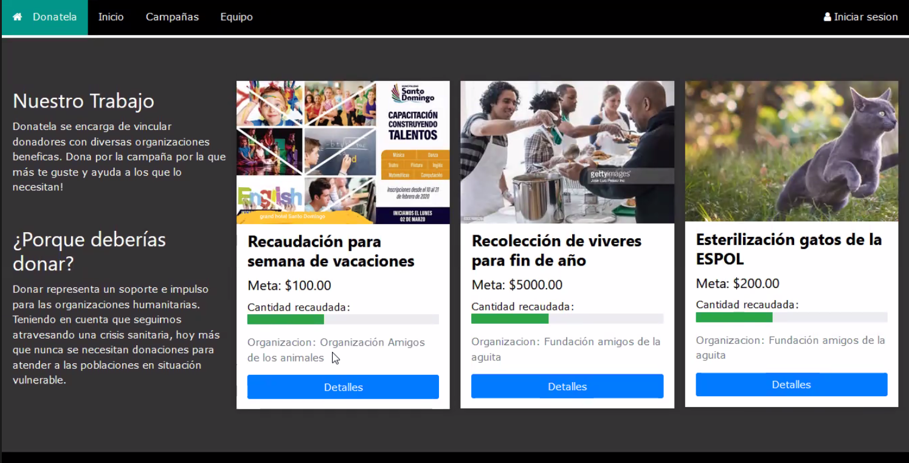
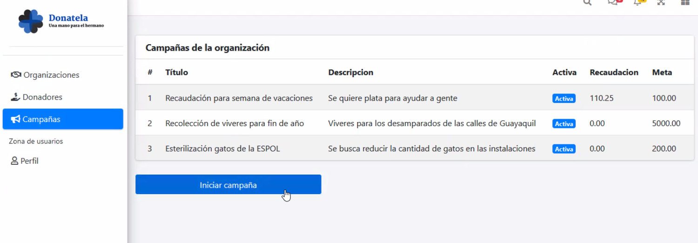
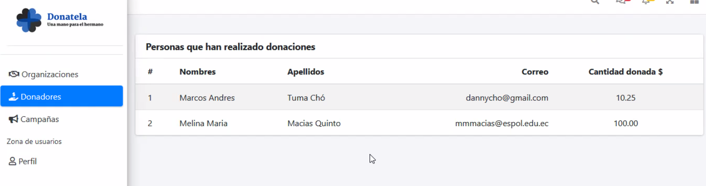
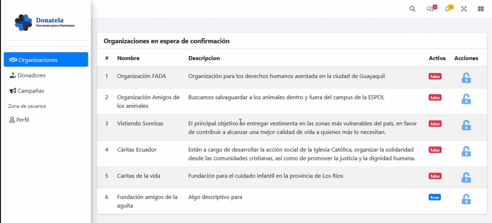

# Bienvenidos a DONATELA (Una mano para el hermano) 
*Aplicacion web sin fines de lucro, destinada a la recoleccion de dinero, para varia campaña de distintas organizaciones y fundaciones, que se encargan de beneficiar a sectores afectados por el covid-19*

<h1 align="center"> DONATELA</h1>
<p align="center"> Logo de la aplicacion web</p>
<p align="center"></p> 

## Arquitectura de la pagina web:
---
<p align="center"></p> 
La arquitectura general de la aplicación se basa en Cliente/Servidor. Utilizaremos un paradigma orientado a objetos (POO), y el modelo arquitectural es MVC para el back-end y MV* para el Font-end. Para el desarrollo Font-end se hace uso del framework Angular con el lenguaje de programación TypeScript. 
En el lado del servidor se utiliza el lenguaje de programación Python con el framework Django. Se hace uso de conceptos de programación funcional (PF) para el tratamiento de datos y programación orientada a aspectos (POA) para realizar una estrategia de registro de actividad.


## Parte importante del codigo con respecto al Back-end de los distintos perfiles
---
### Modelos
```python
class Organizacion(models.Model):
    """Perfil para las organizaciones 
        * Extiende del modelo Usuario
    """
    account = OneToOneField(User, on_delete=CASCADE)

    nombre = CharField(max_length=50, unique=True)
    descripcion = TextField(blank=True, default='')

class DonadorModel(models.Model):
    """Modelo para almacenar la información de los donadores"""

    nombres = CharField(max_length=50, blank=False)
    apellidos = CharField(max_length=50)
    correo = EmailField(blank=True)
    cantidad_donada = DecimalField(blank=False, decimal_places=2, max_digits=6)

class CampanaModel(models.Model):
    """Capañas llevadas a cabo por las organizaciones"""

    titulo = CharField(max_length=50, blank=False)
    descripcion_corta = CharField(max_length=400)
    url_imagen = CharField(blank=False, max_length=400)
    descripcion_completa = TextField(blank=False)
    recaudacion_esperada = DecimalField(default=0.0, decimal_places=2, max_digits=6)
    cantidad_recaudada = DecimalField(default=0.0, decimal_places=2, max_digits=6)
    organizacion = ForeignKey(Organizacion, on_delete=CASCADE)
    estado_campana = CharField(max_length=10,
        choices=[(estado, estado.value) for estado in EstadoCampana]
    )

    def __str__(self):
        return f'[ {self.titulo} - {self.estado_campana} ]'
```

### Vistas 

```python
class OrganizacionView(APIView):

    def get(self, request):

        organizaciones = Organizacion.objects.all()
        data = OrganizacionSerializer(organizaciones, many=True)
        
        return Response(data.data)

    def post(self, request):
        pass
        
class CampanaView(APIView):

    def get(self, request):
        campanas = CampanaModel.objects.all()
        data = CampanaSerializer(campanas, many=True)
        return Response(data.data)

    def post(self, request):
        serializer = CampanaSerializer(data=request.data, partial=True)
        serializer.is_valid(raise_exception=True)
        
        data = serializer.data
        breakpoint()
        newCampana = CampanaModel.objects.create(
            titulo = data.get("titulo"),
            descripcion_corta = data.get("descripcion_corta"),
            url_imagen = data.get("url_imagen"),
            descripcion_completa = data.get("descripcion_completa"),
            recaudacion_esperada = data.get("recaudacion_esperada"),
            cantidad_recaudada = data.get("cantidad_recaudada"),
            estado_campana = data.get("estado_campana"),
            organizacion = Organizacion.objects.get(id=data.get(""))
        )
        return Response(CampanaSerializer(newCampana.data, status = status.HTTP_201_CREATED))

class DonadorView(APIView):

    def get(self, request):

        donadores = DonadorModel.objects.all()
        data = DonadorSerializer(donadores, many=True)
        return Response(data.data)

    def post(self, request):

        serializer = DonadorSerializer(data=request.data)
        serializer.is_valid(raise_exception=True)
        data = serializer.data
        newDonador = DonadorModel.objects.create(
            nombres = data.get("nombres"),
            apellidos = data.get("apellidos"),
            correo = data.get("correo"),
            cantidad_donada = data.get("cantidad_donada")
        )
        newDonador.save()
        return Response(DonadorSerializer(newDonador).data, status = status.HTTP_201_CREATED) 
```
## Parte importante del codigo con respecto al Front-end de los distintos perfiles
### Servicio HTTP 
*Campañas*
```typescript
@Injectable({
  providedIn: 'root'
})
export class CampanasService {
  constructor(private http:HttpClient) { }
  getAllCampanas(){
    return this.http.get(`${environment.main_url}/api/donatela/campanas`)
  }
}
```
*Donador*
```typescript
@Injectable({
  providedIn: 'root'
})
export class DonadorService {
  constructor(private http:HttpClient) { }
  getDonadores(){
    return this.http.get(`${environment.main_url}/api/donatela/donadores`)
  }
}

```
*Organizacion*
```typescript
@Injectable({
  providedIn: 'root'
})
export class OrganizacionService {
  constructor(private http: HttpClient) { }
  getOrganizaciones(){
    return this.http.get(`${environment.main_url}/api/donatela/organizacion`)

  }
}

```

## Guía de usuario
---

Explicacion básica sobre cómo usar DONATELA. 

Donadores: 
Pueden visualizar las campañas actuales, vizualizas mas detallae y donar a su preferencia.

<p align="center"></p> 

Organizacion: 
Deber registrarse en la pagina, luego esperar el correro de notificacion. 
<p align="center"></p> 
Una vez verificado, puede crear campañas. 
<p align="center"></p> 
Puede visualizar, quien y cuanto han donado a sus campañas.
<p align="center"></p> 
 	
Administrador:
Tiene los permisos para aceptar una fundacion.
<p align="center"></p> 

Puede vizualizar las campañas de todas las fundaciones, ademas de los donadores de las distintas campañas. 

## Autor/es
---
- Caballero Macias Aaron 
- Macias Quinto Melina
- Yepez Vera Tatiana
